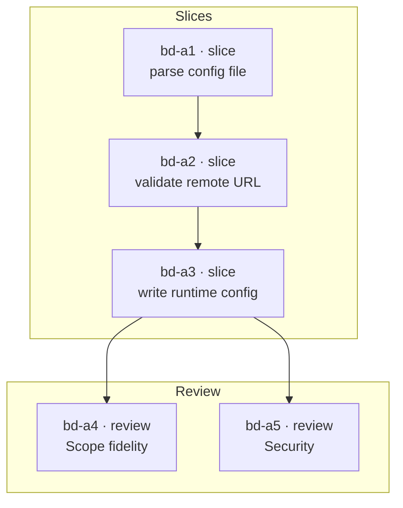

# Create Plan

## Language Definitions

- **Scope snapshot** — human-approved objective, acceptance criteria, failure criteria, and exclusions, frozen once approved.
- **Execution molecule** — one root epic plus its work-bead graph; the only durable result of this skill.
- **Engineering work** — behavior in code, configuration, or scripts that a test can observe failing before the change and passing after it.
- **Authoring work** — prose, instruction, or vocabulary artifacts whose correctness is judged by review and audit rather than by a failing test: skills, specs, glossaries, documentation, and agent instructions.
- **Current-state gap** — desired behavior that code or tests at the source fixed point do not yet satisfy.
- **Proposed execution trace** — evidence-grounded call tree of intended runtime order and depth for one slice, distinguishing binding order from permitted internal variance.
- **Exact model assignment** — command, provider, model id, and thinking level bound to a role.

Repository glossary wording is authoritative where it overlaps. An execution molecule is not a spec-extraction plan, teaching workspace, or `bd mol` template proto.

This skill creates no durable Markdown. It MUST NOT write `PLAN.md`, `.plan`, slice files, verification files, or any `.beads/` state into a source repository.

## Workflow

Load the shared [`beads`](../beads/SKILL.md) skill before any `bd` operation; it owns routing verification, durable-write serialization, graph mechanics, and checkpointing.

### 1. Gate on engineering work

This skill plans **engineering work only**. Every slice it produces carries RED/GREEN/REFACTOR tracer cycles, which require a test that can observably fail before the change. Non-engineering work has no such test, so forcing it into slices produces invented tests, inflated graphs, and scope bloat.

Classify the requested outcome before doing anything else. Engineering work continues to step 2. Non-engineering work **stops without creating a molecule**.

Authoring work — prose, instruction, and vocabulary artifacts — has established owners. Name the owner and route there:

| Requested outcome | Owner |
|---|---|
| Write, revise, split, or audit a skill | [`write-a-skill`](../write-a-skill/SKILL.md) |
| Verify skill frontmatter across agents | [`audit-shared-skills`](../audit-shared-skills/SKILL.md) |
| Change specs, contracts, or requirements | [`update-specs`](../update-specs/SKILL.md) |
| Define or reconcile domain vocabulary | [`ubiquitous-language`](../ubiquitous-language/SKILL.md) |
| Produce an `AGENTS.md` codebase map | [`create-agents-md`](../create-agents-md/SKILL.md) |

Other non-engineering work — research programs, operational runbooks, content production, or any outcome no test can observe failing — has **no planning skill yet**. Stop and say so plainly. Beads can track such work under a future non-engineering planning workflow, but that workflow does not exist; do not approximate it by relaxing tracer cycles, substituting acceptance-only criteria, or widening this skill's scope.

Judge the requested outcome, not the file extension: a change to a Markdown file that a test asserts on is engineering work, while a `.sh` file rewritten purely for prose in its help text is not. When genuinely uncertain, ask whether a test could observe the change failing; if no honest test can, it is not engineering work.

For **mixed scope**, plan only the engineering portion and record every non-engineering portion as an explicit exclusion naming its owner, or naming the absence of one. Do not create non-engineering beads with acceptance-only criteria to keep them in the graph.

Completion criterion: the requested outcome is classified as engineering, non-engineering, or mixed; non-engineering work has stopped with a named owner or an explicit statement that none exists; and any mixed request has its excluded portions written down for the exclusions list before planning continues.

### 2. Pin source identity and fixed point

Verify command-repo routing through the `beads` skill first. Then resolve the canonical source checkout, its normalized repository identity, and one full source fixed point:

```bash
git rev-parse --show-toplevel
git remote get-url origin    # SSH and HTTPS spellings normalize to one identity
git rev-parse HEAD           # full hash, never abbreviated
```

If remote aliases cannot normalize, or the repository has no remote and no explicit key, stop and require an explicit repository key. A spec diff is **not** required; changed specs are evidence when they exist, not a precondition.

Record the caller's current exact model configuration as planner provenance.

Completion criterion: canonical root, normalized repository identity, full source fixed point, and planner provenance are fixed, and `BEADS_DIR` routing is verified.

### 3. Gather evidence and approve the scope snapshot

Inspect relevant code, tests, documentation, available specifications, and risks at the fixed point. Account for each desired behavior as already satisfied with concrete evidence, a current-state gap with evidence of what is absent, or ambiguous with the conflicting sources quoted.

Then obtain **explicit human approval** of the scope snapshot: objective, acceptance criteria, failure criteria, and exclusions. Ambiguity that prevents a safe technical sequence stops planning; report the exact decision needed rather than inferring it.

Any authoring portion identified in step 1 MUST appear in the exclusions with its owning skill named, so the boundary is frozen with the snapshot instead of resurfacing as slice work later.

The snapshot freezes on approval. Any later mutation requires a linked decision bead and fresh human approval.

Completion criterion: every desired behavior has an evidenced disposition, only current-state gaps remain in scope, any excluded authoring work names its owner, and the human has explicitly approved all four snapshot fields.

### 4. Design slices, traces, and dependencies

Design context-sized vertical slices that each fit one fresh agent context and deliver observable behavior through the applicable layers. Give every slice explicit RED/GREEN/REFACTOR cycles, because implementation agents may run an economical model.

Encode only genuine blocking dependencies. For a wide migration or mechanical refactor, use expand → migrate in bounded passing batches → contract, placing contraction after every migration.

Give each slice at least one proposed execution trace where runtime or operational order is material: a nested call tree with sequence numbers, `path:symbol` where known, and markers distinguishing existing, changed, new, and uncertain frames plus binding required order versus proposed internal structure. Existing frames need fixed-point evidence. Distinct entry points and async roots get separate traces; concurrent branches are marked unordered unless order is guaranteed. Observable or safety-critical ordering is binding; internal proposed frames may vary with rationale. A trace is an intended call tree, not captured runtime evidence or an exhaustive graph. Non-runtime work may substitute an explicitly justified ordered operational flow.

Each slice carries: behavior, dependencies, acceptance and failure criteria, a public test seam that survives refactoring, tracer cycles, focused commands, likely files, and risks.

Completion criterion: every gap maps to at least one context-sized slice, every slice has a public test seam and applicable trace, and dependency edges reflect genuine blockers only.

### 5. Approve review topology and exact assignments

Propose one review preset and obtain human approval for the complete policy:

| Preset | Required final gates | Depth |
|---|---|---|
| Lean | Repository mechanical gates; Scope fidelity | One independent Scope pass |
| Standard | Lean plus integrated Test Quality, Standards, Premortem, Security | One independent pass per non-mechanical gate |
| High assurance | Standard plus risk-triggered gates | Standard depth plus approved second passes for selected risk-bearing gates |

Independent per-slice Test Quality is mandatory before integration under **every** preset.

In the same approval, settle exact role defaults and per-bead overrides, reviewer independence rules, the exact coordinator assignment, escalation ladders, correction allowances (default 2), and critical-invariant triggers. Every executable bead receives a materialized exact assignment. An unavailable assignment blocks pending human-approved reassignment; it is never silently substituted and is not an escalation trigger.

Completion criterion: the human has approved one preset with any overrides, and every executable bead has a resolved exact model assignment, escalation ladder, and correction allowance.

### 6. Create the graph and validate before activation

Create the root molecule in **draft**, then its complete work graph, then validate. Serialize every durable write per the `beads` skill and retry contention rather than skipping it.

Validate before exposing any ready work:

- complete scope coverage — every acceptance criterion maps to at least one slice;
- acyclicity — `bd dep cycles` reports none;
- every executable bead carries its exact assignment;
- every applicable slice carries its trace; and
- review and remediation topology matches the approved policy.

A partial or failing graph stays draft/blocked and MUST NOT expose slices as ready. Reconcile it or explicitly discard the draft. Only after validation passes, mark the molecule ready and push the initial semantic checkpoint.

### 7. Render the molecule map

After validation passes, render the created graph as a Mermaid diagram so the agent that executes it and the human who approved it can both see the shape of the work at a glance. Derive it from what `bd` actually returned — real bead ids and real dependency edges — not from the design intent in step 4, so the diagram is evidence that the graph matches the plan.

Show each bead's id, its kind, and a short behavior label; draw blocking dependencies as arrows from blocker to blocked; group by kind so slices, reviews, and remediation are visually distinct. Omit attempt beads — none exist yet at creation, and they are non-blocking operational nodes that would obscure the frontier.



Report the diagram alongside the root molecule id. Label it **non-authoritative**: Beads remains the source of truth, and a diagram that disagrees with `bd` means the diagram is stale, never the graph. Do not write it to a durable Markdown file in the source repository.

Completion criterion: one ready molecule exists with a validated acyclic graph, the initial checkpoint is pushed, the root id is reported, a Mermaid map rendered from actual `bd` output accompanies it and is labelled non-authoritative, and no durable Markdown or source-repository `.beads/` state was created.
