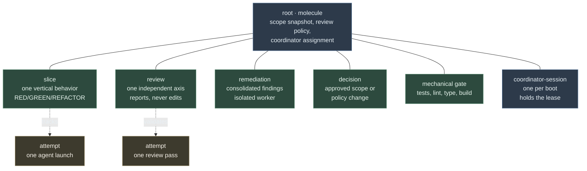
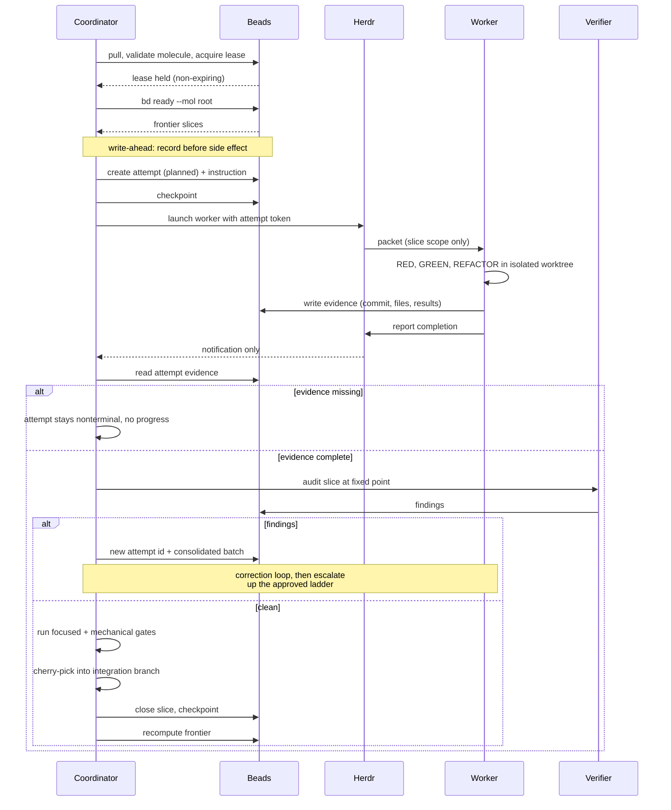
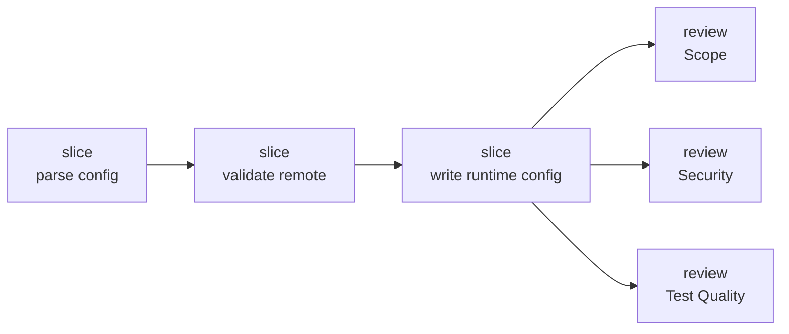
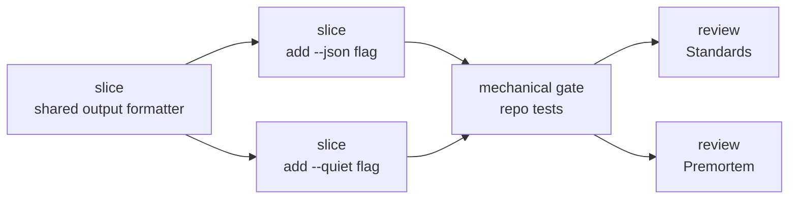
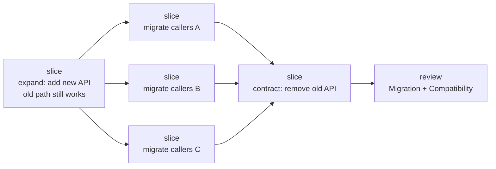
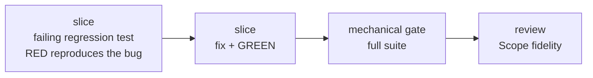
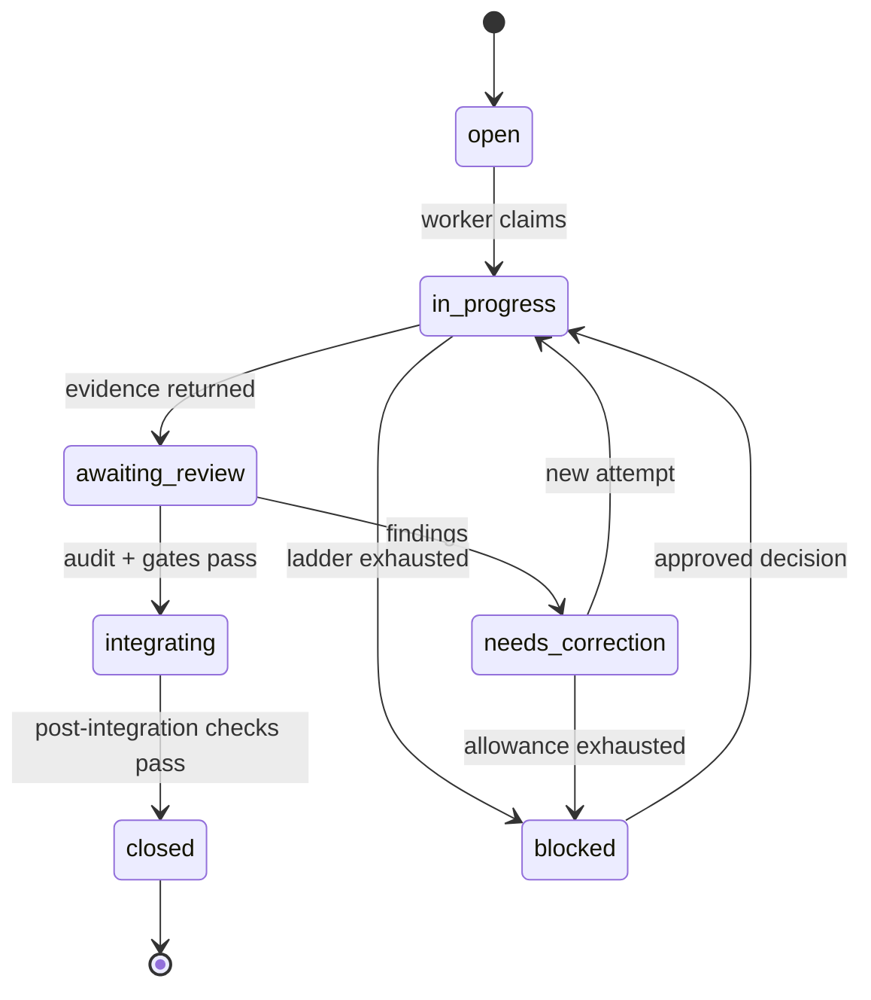
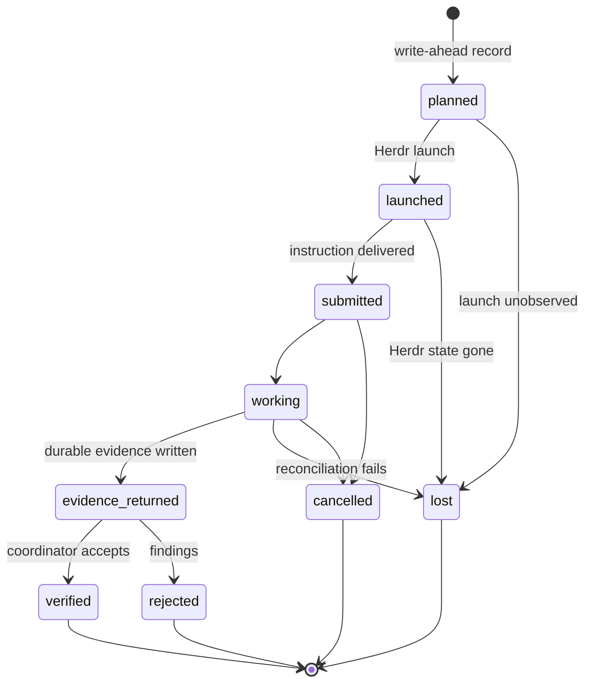
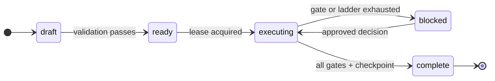

# Workflow Shapes

Reference for the Beads execution model: what kinds of beads exist, how a molecule is executed, what shapes real engineering work takes, and how states transition.

Diagrams here are **illustrative models, not templates**. Real bead ids come from `bd`; real graphs encode only genuine blockers. `specs/execution-coordination.md` is authoritative wherever this file and it disagree.

## Bead taxonomy

A molecule is a root epic plus everything hanging off it. Two edge kinds do very different jobs:

- **Blocking edges** connect work beads and determine readiness. `bd ready --mol <root>` walks these.
- **Operational edges** connect attempts to the work they track. They never block anything, so retries and lost attempts cannot pollute the frontier.

Solid lines are containment; dotted lines are the non-blocking operational edges. Only `slice`, `review`, `remediation`, `decision`, and `mechanical gate` are work beads. Attempts and coordinator sessions are permanent records, never frontier candidates.

## Execution lifecycle

What `execute-engineering-molecule` actually does per slice. The ordering constraint that matters most: **the durable attempt record is written before the agent is launched**, so a coordinator that dies mid-launch can reconcile rather than blindly relaunch.

Herdr completion is a notification, never evidence. A slice closes only after implementation evidence, an independent test-quality pass, mechanical gates, integration, and post-integration checks — which is why only closed blockers release dependent work.

## Worked workflow shapes

### Linear feature

Each slice genuinely depends on the last. Reviews fan out from the final integrated point, not from individual slices.

### Independent slices with review fan-out

The common mistake is chaining slices that have no real dependency. If two behaviors touch different seams, they are parallel — the graph should say so, because a false edge idles a worker for no reason.

Only the shared formatter is a genuine blocker. The two flags are independent and can run concurrently.

### Wide migration — expand, migrate, contract

Contraction must come after every migration batch, or the old form disappears while callers still use it. Batches are parallel; the contract step joins them.

### Bugfix with regression lock

The failing test comes first and is the whole point — it must fail before the fix and pass after, which is exactly the property authoring work cannot provide.

## State machines

### Work bead

Only `closed` releases dependents into the frontier. `blocked` needs an approved decision bead to move — never a silent retry.

### Attempt

`lost` is terminal by design. A lost attempt is never resumed under its old id — resumed work always gets a new attempt, so uncertain identity can never be mistaken for confirmed progress.

### Molecule and sync

Sync state is orthogonal: `clean` normally, `pending` when the remote is unreachable. Under `pending` only the leased host may continue working, and both lease transfer and completion stay blocked until pull and push succeed.
