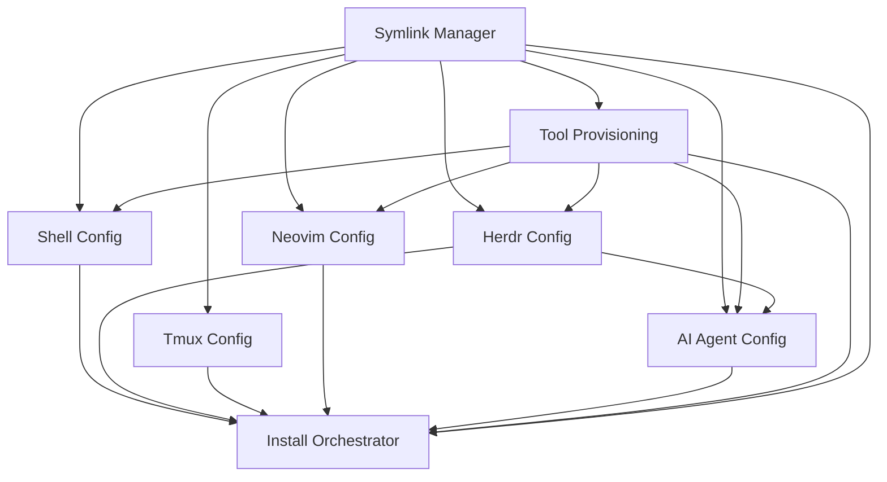

# Personal Dotfiles Manager Specification Suite

> **Version**: 0.3.0
> **Last Updated**: 2026-07-08
> **Purpose**: Complete specification for the personal dotfiles manager — automates setup of a Herdr/tmux + neovim + zsh dev environment across Linux and macOS. Primarily for personal use, serves as reference/inspiration for others.

---

## Project Summary

A personal dotfiles manager that automates the setup of a Herdr-first terminal workspace with tmux retained as a legacy fallback, plus neovim and zsh, across Linux (Ubuntu/Debian) and macOS. It uses a symlink-based architecture to maintain configurations in version control while deploying them to standard system locations. The primary user is the owner, but the repository serves as a reference for others seeking a reproducible, version-controlled development environment.

---

## Technology Stack

| Component | Technology | Version | Purpose |
|-----------|-----------|---------|---------|
| Install script | Bash | 4+ | Idempotent setup orchestrator |
| Shell | Zsh + Oh My Zsh | latest | Primary interactive shell |
| Terminal multiplexer | Herdr | stable | Default session/workspace manager and SSH multiplexer |
| Legacy multiplexer | Tmux | 3+ | Fallback session management and migration compatibility |
| Editor | Neovim | 0.10+ | Primary editor (kickstart.nvim + custom layer) |
| Editor plugin manager | lazy.nvim | latest | Neovim plugin management |
| Editor packages | Mason | latest | LSP/formatter/linter installation |
| Extension language | Lua | 5.1 (LuaJIT) | Neovim custom plugins |
| Runtime | Go | 1.24+ | Development language and tooling |
| Runtime | Node.js (via fnm) | LTS | AI CLI tools and extensions |
| File manager | Yazi | latest | Terminal file manager |
| Git UI | lazygit | latest | Terminal git interface |
| Smart cd | Zoxide | latest | Directory jumping |

---

## Reading Order

For an extracting or implementing agent, read specs in this order:

### Phase 1: Foundation

1. **[UBIQUITOUS_LANGUAGE.md](UBIQUITOUS_LANGUAGE.md)** — Shared domain vocabulary
2. **[DESIGN_LANGUAGE.md](DESIGN_LANGUAGE.md)** — Interface vocabulary (CLI + config UI)
3. **[parameters.md](parameters.md)** — All tuning values with rationale

### Phase 2: Core

4. **[symlink-manager.md](symlink-manager.md)** — Symlink creation, backup, and verification
5. **[tool-provisioning.md](tool-provisioning.md)** — Dependency and tool installation

### Phase 3: Supporting

6. **[shell-config.md](shell-config.md)** — Zsh + Oh My Zsh configuration
7. **[herdr-config.md](herdr-config.md)** — Herdr default multiplexer, config, SSH behavior, integrations
8. **[tmux-config.md](tmux-config.md)** — Tmux keybindings, nested sessions, legacy fallback integration
9. **[neovim-config.md](neovim-config.md)** — Kickstart base + custom plugin layer
10. **[ai-agent-config.md](ai-agent-config.md)** — AI agent configs, shared skills, symlink wiring
### Phase 4: Leaf

11. **[install-orchestrator.md](install-orchestrator.md)** — Top-level orchestrator that calls everything

---

## Dependency Graph

---

## Key Dependencies

| Spec | Depends On | Depended By |
|------|------------|-------------|
| symlink-manager.md | — | tool-provisioning, shell-config, herdr-config, tmux-config, neovim-config, ai-agent-config, install-orchestrator |
| tool-provisioning.md | symlink-manager | shell-config, herdr-config, neovim-config, ai-agent-config, install-orchestrator |
| shell-config.md | symlink-manager, tool-provisioning | install-orchestrator |
| herdr-config.md | symlink-manager, tool-provisioning | shell-config, ai-agent-config, install-orchestrator |
| tmux-config.md | symlink-manager | install-orchestrator |
| neovim-config.md | symlink-manager, tool-provisioning | install-orchestrator |
| ai-agent-config.md | symlink-manager, tool-provisioning | install-orchestrator |
| install-orchestrator.md | all other specs | — |

---

## Quick Reference

| Spec | Description | Version |
|------|-------------|---------|
| [parameters.md](parameters.md) | All tuning values with rationale | 1.5.0 |
| [symlink-manager.md](symlink-manager.md) | Symlink creation, backup, and verification | 1.3.0 |
| [tool-provisioning.md](tool-provisioning.md) | Dependency and tool installation | 1.2.0 |
| [shell-config.md](shell-config.md) | Zsh + Oh My Zsh configuration | 1.1.0 |
| [herdr-config.md](herdr-config.md) | Herdr default multiplexer and migration contract | 0.1.0 |
| [tmux-config.md](tmux-config.md) | Tmux keybindings and nested sessions | 1.1.0 |
| [neovim-config.md](neovim-config.md) | Kickstart + custom plugin layer | 0.1.0 |
| [ai-agent-config.md](ai-agent-config.md) | AI agent configs and shared skills | 1.9.0 |
| [install-orchestrator.md](install-orchestrator.md) | Top-level idempotent setup orchestrator | 1.3.0 |

---

## Implementation Checklist

### Phase 1: Foundation

- [ ] Extract all parameters with values and rationale from install.sh and config files
- [ ] Review ubiquitous language for term consistency across all specs

### Phase 2: Core

- [ ] Extract symlink-manager spec from install.sh symlink functions
- [ ] Extract tool-provisioning spec from install.sh dependency installation logic

### Phase 3: Supporting

- [ ] Extract shell-config spec from zsh/.zshrc.custom
- [ ] Extract herdr-config spec from herdr/config.toml
- [ ] Extract tmux-config spec from tmux/.tmux.conf
- [ ] Extract neovim-config spec from nvim/custom/ plugin files
- [ ] Extract ai-agent-config spec from codex/, claude/, pi/, copilot/ directories

### Phase 4: Leaf

- [ ] Extract install-orchestrator spec from install.sh main flow and OS detection
